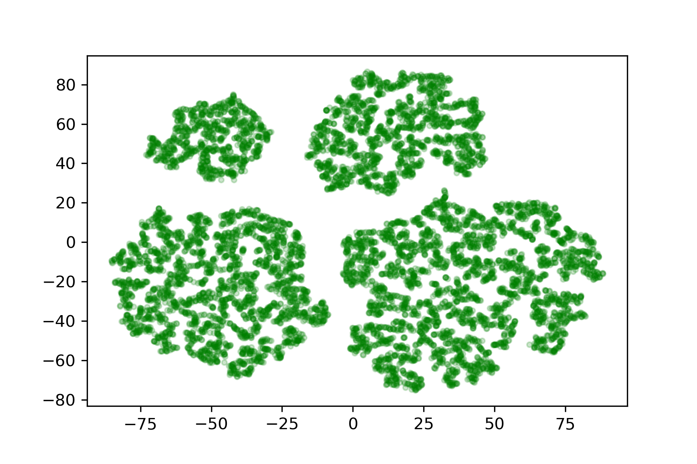

## DISCRIPTION

This project implements the EM algorithm and VB algorithm for fitting a Gaussian Mixture Model into a set of data points.

The EM implementation is tested to provide comparable results with sklearn.mixture.GaussianMixture (similar log-likelihood score)

## USAGE 

For running the files, using the following commands:

### For EM algorithm:

```
python EM.py [number of clusters] [data file] [output file for posterior] [output file for model parameters]
```

[number of clusters]: number of clusters in the GMM, has to be integer.
[data file]: each line in data file contains elements of a data point, which separated by comma ','.
[output file for posterior]: each line contains the posterior probability for a data point, the elements are separated by comma ','
[output file for model parameters]: binary file contains the dictionary of the model's parameters.

#### Example
The command
```
python EM.py 4 x.csv z.csv params.dat
```
will fit a GMM of 4 clusters to the data in x.csv, and output the posterior probabilitis into z.csv, and save the GMM's parameters into binary file params.dat


### For VB algorithm:

the command is the same, except that you need to replace EM.py with VB.py

## EXAMPLE

### Data
x.csv file: 3-d coordinates of data points

2-D visualization with t-SNE:

<p align="center">
  
</p>

### Visualization of the clustering by EM and VB algorithms

Both EM and VB algorithms correctly fit a GMM with 4 clusters into the data

<p align="center">
  
  
</p>
